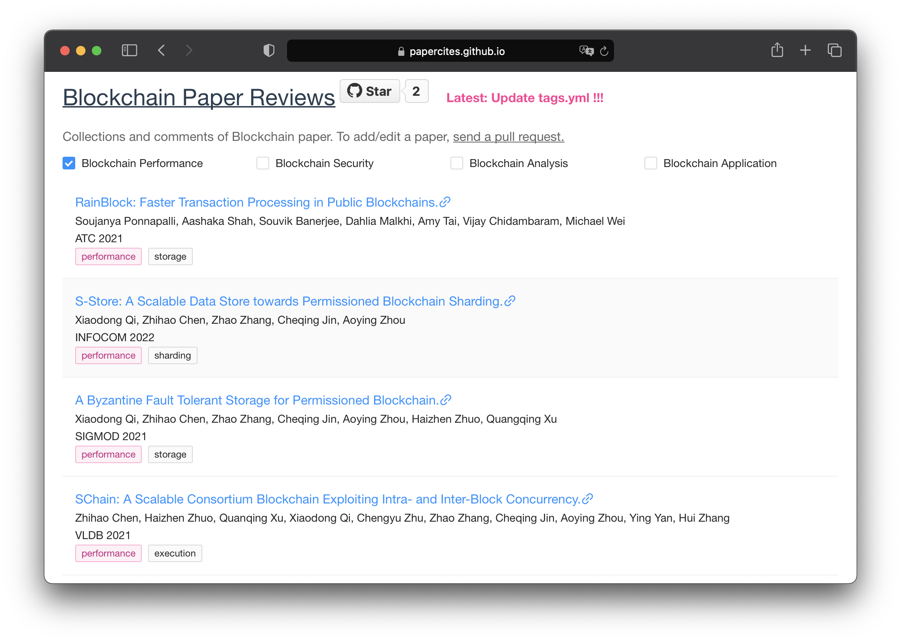

# Blockchain-Paper-Reviews
[](https://github.com/papercites/blockchain-paper-reviews/blob/main/LICENSE)
[](https://github.com/papercites/blockchain-paper-reviews/commits/main)
[](https://github.com/papercites/blockchain-paper-reviews/pulls)

English | [简体中文](./README.zh-CN.md)
Add a statistic table after

Helping researchers review top blockchain papers.
Preview: [Demo](https://papercites.github.io/)

[](https://github.com/papercites/blockchain-paper-reviews/blob/main/.readme_assets/screenshot.png)

**Standing on the shoulders of giants!**

## Add/Update a paper
Contributions are welcomed and greatly appreciated! For further contribution, please email [chenzh@stu.ecnu.edu.cn](chenzh@stu.ecnu.edu.cn) through your edu email address.

To add or update information:
- Fork the repo
- Add/Update the yml file of papers/conf_type/conf_name.yml
- Send a [pull request](https://github.com/papercites/blockchain-paper-reviews/pulls)

## Paper Recording
Example file: papers/DB/vldb.yml

```
# VLDB
- title: 'SChain: A Scalable Consortium Blockchain Exploiting Intra- and Inter-Block Concurrency.'
  authors: Zhihao Chen, Haizhen Zhuo, Quanqing Xu, Xiaodong Qi, Chengyu Zhu, Zhao Zhang, Cheqing Jin, Aoying Zhou, Ying Yan, Hui Zhang
  conf: VLDB
  year: 2021
  url: https://dl.acm.org/doi/10.14778/3476311.3476348
  tag: 'performance'
  subtag: ['execution']
```
Description of the fields:
<table>
   <tr>
      <th colspan="3">Field name</th>
      <th>Description</th>
   </tr>
   <tr>
      <td colspan="3"><code>title</code>*</td>
      <td>Paper title</td>
   </tr>
   <tr>
      <td colspan="3"><code>authors</code>*</td>
      <td>Authors of the paper</td>
   </tr>
   <tr>
      <td colspan="3"><code>conf</code>*</td>
      <td>Conference the paper published</td>
   </tr>
   <tr>
      <td colspan="3"><code>year</code>*</td>
      <td>Year the paper published</td>
   </tr>
   <tr>
      <td colspan="3"><code>tag</code>*</td>
      <td>Tag of the paper</td>
   </tr>
   <tr>
      <td colspan="3"><code>subtag</code></td>
      <td>SubTags of the paper</td>
   </tr>
   <tr>
      <td colspan="3"><code>url</code>*</td>
      <td>Link of the paper</td>
   </tr>
</table>

Fields marked with asterisk (*) are required.
## Contribution
Maintained by [@jacklightChen](https://github.com/jacklightChen).

If you find it useful, try follow [him](https://www.researchgate.net/profile/Zhihao_Chen23) on ResearchGate.

## License
[](https://app.fossa.com/projects/git%2Bgithub.com%2Fpapercites%2Fblockchain-paper-reviews?ref=badge_large)